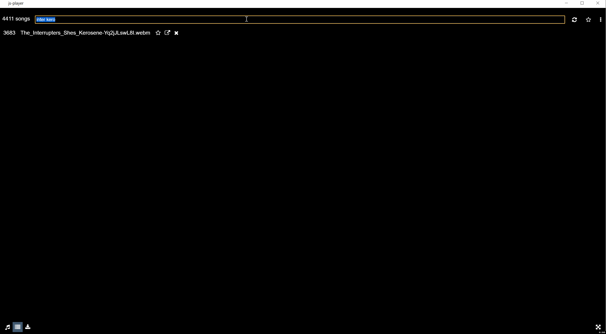

## JS Player

Media player, browser, and syncher (with youtube) as a standalone desktop app (electron).

### keyboard shortcuts

- `1`, `2`, `3` to switch between the player, browser, and syncher.
- `space` or `down arrow` to pause/resume.
- `left arrow` and `right arrow` to skip to previous and next track.
- `<` and `>` to rewind or forward 10 seconds. 
- `f` to toggle fullscreen
